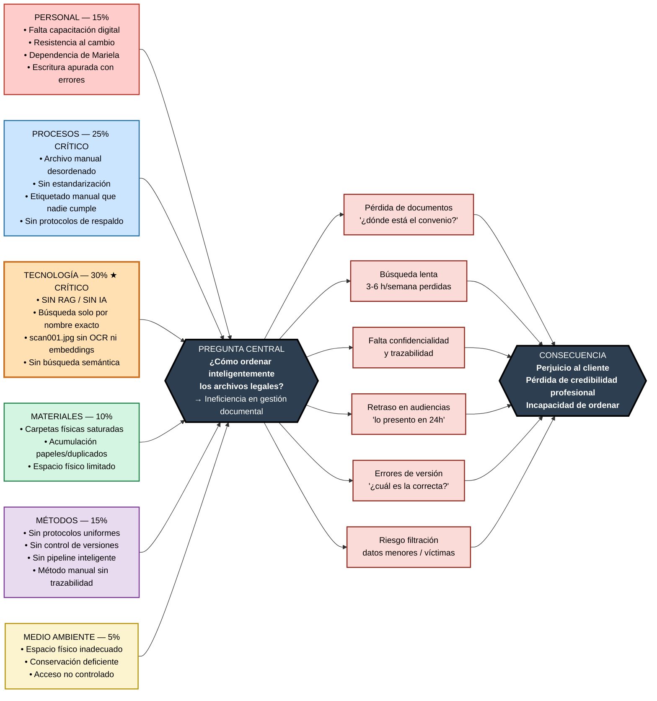
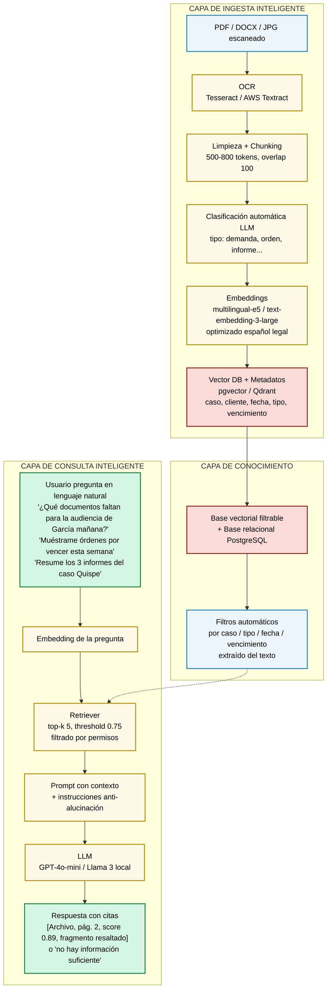

# DIAGRAMA DE ISHIKAWA (ESPINA DE PESCADO)

## SISTEMA DE GESTIÓN DE CONOCIMIENTO (KM) CON RAG — BUFFET DE ASISTENCIA FAMILIAR

### EQUIPO DE TRABAJO

| # | Nombre |
|---|--------|
| 1 | Nahomi Humerez |
| 2 | Mariana del Arroyo |
| 3 | Santiago Acha |
| 4 | Jorge Saenz |

---

### PREGUNTA CENTRAL DEL PROYECTO

**¿Cómo ordenar los archivos y documentos legales oficiales de manera inteligente para abogados de ley familiar?**

**Solución propuesta:** Sistema de Gestión de Conocimiento (KM) basado en RAG (Retrieval-Augmented Generation) para filtrar, clasificar y organizar los datos de forma automática, permitiendo búsquedas en lenguaje natural y respuestas con cita de fuente verificable.

La pregunta central constituye el problema central del diagrama. La ineficiencia actual impide el ordenamiento inteligente; el sistema KM con RAG es la respuesta que ataca directamente las causas raíz identificadas.

---

### PROBLEMA CENTRAL IDENTIFICADO

**Ineficiencia en la gestión documental que impide ordenar inteligentemente los archivos legales y afecta la calidad del servicio legal en asistencia familiar**

---

### DIAGRAMA ISHIKAWA — Renderizado con `Mermaid.js`

> **Librería utilizada:** [Mermaid.js](https://mermaid.js.org/) (`flowchart LR`). Renderizado nativo en GitHub/GitLab/Markdown. Colores por categoría 6M + ponderación Ishikawa. La espina central converge en la pregunta/problema y se expande hacia los efectos.

**Lectura del diagrama:**
- **Espina superior (causas con mayor peso):** `TECNOLOGÍA (0.30)` + `PROCESOS (0.25)` = 55% del problema. Son las causas priorizadas por la Matriz de Coeficientes.
- **Espina inferior:** `MATERIALES`, `MÉTODOS` y `MEDIO AMBIENTE` completan las 6M.
- **Cabeza del pescado (derecha):** la pregunta/problema central.
- **Cola (efectos):** 6 efectos que confluyen en la consecuencia final: perjuicio al cliente y pérdida de credibilidad.

> Si tu visor MD no renderiza Mermaid, el diagrama es igualmente interpretable como grafo dirigido: 6 categorías → Problema → 6 efectos → Consecuencia.

---

### ANÁLISIS DE CAUSA RAÍZ (PROBLEMA COMÚN IDENTIFICADO)

| Categoría | Causas Identificadas | Impacto | ¿Cómo lo resuelve el RAG? |
|-----------|---------------------|---------|---------------------------|
| **PERSONAL** | Falta de capacitación en herramientas digitales; resistencia al cambio; dependencia de personal administrativo único (Mariela); escritura apurada con errores | Alto | Chat en lenguaje natural, no requiere etiquetado perfecto. Tolera errores y sinónimos legales |
| **PROCESOS** | Procesos de archivo desordenados; falta de estandarización; etiquetado manual que nadie cumple; ausencia de protocolos de respaldo | Crítico | **Clasificación automática** por LLM: al subir, el RAG lee el contenido y propone tipo/caso/fecha. Filtrado y organización sin esfuerzo manual |
| **TECNOLOGÍA** | Ausencia de sistema de gestión documental; **ausencia total de RAG/IA**; búsqueda solo por nombre exacto que falla con `scan001.jpg`; archivos sin OCR ni embeddings; sin búsqueda semántica | **Crítico** | **Core RAG:** OCR → chunking → embeddings (pgvector/Qdrant) → búsqueda semántica + chat con citas. Ordena inteligentemente aunque el archivo esté mal nombrado |
| **MATERIALES** | Carpetas físicas saturadas; acumulación de papeles innecesarios y duplicados; espacio físico limitado | Alto | Digitalización con OCR + vectorización; un solo repositorio KM centralizado y filtrable |
| **MÉTODOS** | Falta de protocolos uniformes; ausencia de control de versiones; ausencia de respaldos periódicos; método manual sin pipeline inteligente | Alto | Pipeline RAG estandarizado y trazable; control de versiones + historial de consultas RAG |
| **MEDIO AMBIENTE** | Espacio físico inadecuado; condiciones de conservación deficientes; acceso no controlado a archivos | Medio | Acceso digital seguro desde cualquier lugar (juzgado, celular) con control de acceso por rol y a nivel de chunk |

---

### PROBLEMA COMÚN IDENTIFICADO EN LOS TRES ENTREVISTADOS

Los tres abogados especializados en asistencia familiar enfrentan el mismo problema central: no logran ordenar los archivos y documentos legales oficiales de manera inteligente. La búsqueda de "convenio García" no arroja resultados porque el archivo se denomina `DOC_FINAL2.pdf`. Pierden entre 3 y 6 horas semanales en búsquedas, sufren retrasos en audiencias, pérdida de credibilidad y riesgo de filtración. La causa raíz común es la ausencia de un sistema KM que filtre y organice automáticamente el contenido, no solo el nombre del archivo.

**Evidencia textual:**
- Abogado 01 (12 años): *"Que me entienda aunque escriba mal... Que yo escriba 'Mamani alimentos' y me aparezca TODO"*
- Abogada 02 (8 años): *"Que escriba 'informe psicológico Quispe niña' y me salga, aunque se llame DOC_234234.pdf"*
- Abogada 03 (3 años): *"Que yo le pueda preguntar como si fuera una persona... aunque yo escriba mal, apurada"*

---

### SÍNTOMAS COMUNES DETECTADOS:

1. **Archivos mal nombrados irrecuperables** — `scan001.jpg` con informe forense crítico que no se encuentra por búsqueda tradicional
2. **Pérdida de documentos** — Todos reportan haber perdido o tardado en encontrar documentos críticos (convenios, órdenes, informes)
3. **Búsqueda lenta 3-6 h/semana** — Tiempo que debería dedicarse a defensa legal
4. **Retrasos en audiencias** — Incapacidad de presentar pruebas a tiempo ante jueces ("lo presento en 24h")
5. **Riesgo de seguridad** — Contraseñas débiles, sin cifrado ni auditoría; datos de menores/víctimas expuestos
6. **Falta de control de versiones** — Dudas sobre cuál es la demanda correcta
7. **Dependencia de persona clave** — Si la secretaria falta, nadie encuentra nada
8. **Imposibilidad de preguntas complejas** — No pueden preguntar "¿qué falta para la audiencia de mañana?" sin revisar expediente completo

---

### PROPUESTA DE SOLUCIÓN: SISTEMA KM BASADO EN RAG

Respuesta a la pregunta central: implementación de un Sistema de Gestión de Conocimiento (KM) basado en RAG para filtrar y organizar los datos de forma automática.

#### Arquitectura KM-RAG propuesta (Mermaid)

#### Funcionalidades KM-RAG que ordenan inteligentemente:

- **Filtrado automático:** Al subir, el sistema lee el contenido y auto-organiza por caso/tipo/fecha sin que el abogado etiquete manualmente.
- **Organización semántica:** Entender que "convenio de visitas", "acuerdo de régimen de visitas" y "acta de visitas" son lo mismo.
- **Búsqueda que perdona errores:** Encontrar "informe forense Gutiérrez" aunque el archivo se llame `scan001.jpg` porque el contenido fue vectorizado.
- **Chat de conocimiento:** Preguntas complejas con respuesta directa y trazable, no lista de 50 archivos para revisar uno por uno.
- **Alertas inteligentes:** RAG extrae fechas de vencimiento del texto ("vigencia 90 días desde 12/02/2026") y genera alertas proactivas.
- **Seguridad KM:** Cifrado de embeddings + control de acceso a nivel de chunk + auditoría de quién preguntó qué.

#### Beneficios esperados (vinculados a causas del Ishikawa):

| Antes (causa) | Después (con KM-RAG) |
|---------------|----------------------|
| Búsqueda por nombre exacto falla | Búsqueda semántica funciona aunque el nombre sea malo |
| 3-6 h/semana perdidas buscando | < 10 segundos por pregunta con cita exacta |
| Alguien debe etiquetar manualmente | Auto-clasificación por LLM al ingerir |
| No se puede preguntar "¿qué falta?" | Chat responde "Te faltan X e Y según expediente" |
| Papeles saturados, duplicados | Repositorio único KM filtrable y desduplicado |
| Riesgo de filtración, sin trazabilidad | Acceso con roles, links temporales, log RAG |

---

### MATRIZ DE COEFICIENTES DE CAUSA-EFECTO (ponderación Ishikawa)

Cuantifica el peso de cada categoría causal sobre la ineficiencia central. Coeficiente normalizado sobre 1.00.

| Categoría Ishikawa | Coef. (Ci) | Peso % | Justificación (evidencia entrevistas) | Causa raíz prioritaria |
|--------------------|------------|--------|---------------------------------------|------------------------|
| **TECNOLOGÍA** | **0.30** | 30% | Sin RAG/IA, búsqueda por nombre falla con `scan001.jpg`, sin OCR/embeddings. Los 3 abogados lo mencionan como dolor principal | Ausencia total de RAG |
| **PROCESOS** | **0.25** | 25% | Archivo manual desordenado, etiquetado que nadie cumple, sin protocolos | Falta de estandarización |
| **PERSONAL** | **0.15** | 15% | Falta capacitación, resistencia al cambio, dependencia de Mariela, escritura apurada | Dependencia de persona clave |
| **MÉTODOS** | **0.15** | 15% | Sin control de versiones, sin respaldos, sin pipeline inteligente | Método manual sin trazabilidad |
| **MATERIALES** | **0.10** | 10% | Carpetas saturadas, duplicados, papeles innecesarios | Acumulación física |
| **MEDIO AMBIENTE** | **0.05** | 5% | Espacio limitado, conservación deficiente, acceso no controlado | Infraestructura física |
| **TOTAL** | **1.00** | **100%** | | |

Interpretación: Tecnología (0.30) + Procesos (0.25) = 55% del problema. Por ello, la solución KM-RAG prioriza la intervención sobre esas dos categorías con mayor ponderación. La matriz de riesgos asociada (CR = P×I) se desarrolla en Matriz_Coeficientes.md, Sección 6.

---

### VALIDACIÓN DE LA SOLUCIÓN CON LAS ENTREVISTAS

La solución KM-RAG fue validada contra las tres entrevistas: los abogados solicitan explícitamente que el sistema "entienda aunque se escriba con errores", "responda como si fuera una persona" y "lea los documentos por ellos". Este requerimiento no es resoluble mediante búsqueda tradicional por palabras clave, sino únicamente mediante RAG.

Criterio de éxito RAG definido en el TDR: Precision@5 >85%, alucinación <5%, respuesta siempre con cita verificable, validado con 50 preguntas reales del buffet en Sprint 6.

---
