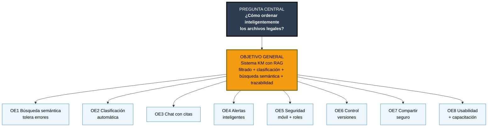

# MATRIZ DE COHERENCIA

## SISTEMA DE GESTIÓN DE CONOCIMIENTO (KM) CON RAG PARA EL BUFFET DE ABOGADOS DE ASISTENCIA FAMILIAR

### EQUIPO DE TRABAJO

| # | Nombre |
|---|--------|
| 1 | Nahomi Humerez |
| 2 | Mariana del Arroyo |
| 3 | Santiago Acha |
| 4 | Jorge Saenz |

| Campo | Descripción |
|-------|-------------|
| **Asignatura** | Gestión de Proyectos Informáticos |
| **Documento** | Matriz de Coherencia — Anexo B del TDR |
| **Versión** | 2.0 — Agosto 2026 (simplificada en base a entrevistas) |

---

### 1. TÍTULO DEL PROYECTO

**Desarrollo e implementación de Sistema de Gestión de Conocimiento (KM) basado en RAG para ordenar, filtrar y organizar archivos y documentos legales oficiales de manera inteligente para el Buffet de Abogados de Asistencia Familiar**

---

### 2. PREGUNTA CENTRAL

**¿Cómo ordenar los archivos y documentos legales oficiales de manera inteligente para abogados de ley familiar?**

**Problema que origina la pregunta:** Ineficiencia en la gestión documental que impide el ordenamiento inteligente de archivos legales —archivo manual desorganizado, búsqueda por nombre exacto que falla con `scan001.jpg` / `DOC_FINAL2.pdf`, dependencia de una sola persona (Mariela), pérdida de 3-6 h/semana por abogado, retrasos en audiencias y riesgo de filtración de datos sensibles de menores y víctimas— evidenciado de forma transversal en las 3 entrevistas.

---

### 3. OBJETIVO GENERAL

**Desarrollar e implementar un Sistema de Gestión de Conocimiento (KM) web basado en RAG que permita ordenar los archivos y documentos legales oficiales de manera inteligente, mediante filtrado, clasificación automática, búsqueda semántica y generación de respuestas con trazabilidad, organizando, protegiendo y gestionando eficientemente toda la documentación de los casos legales.**

*Fuente TDR 3.1 — Validado contra entrevistas: responde directamente a "que me entienda aunque escriba mal" (Abogado 01), "que él solito entienda de qué se trata" (Abogada 02) y "que yo le pueda preguntar como si fuera una persona" (Abogada 03).*

**Indicadores de verificación del OG (RNF11/RNF12):** Tiempo medio de búsqueda < 10 seg/consulta; Precision@5 > 85% y alucinación < 5% con 50 preguntas reales (Sprint 6); de 3-6 h/semana a < 0.5 h/semana; 0 incidentes de filtración; toda respuesta con cita verificable `[archivo, pág., fragmento, score]` o mensaje controlado.

---

### 4. OBJETIVOS ESPECÍFICOS — Fundamentados en las entrevistas

> Cada objetivo específico nace de una necesidad textual detectada en las entrevistas anónimas 01, 02 y 03. Se priorizan los dolores comunes a los tres abogados.

| # | Objetivo Específico | Descripción | Evidencia textual (entrevista) | Fuente |
|---|---------------------|-------------|-------------------------------|--------|
| **OE1** | **Implementar motor de búsqueda semántica con RAG que tolere errores y sinónimos legales** | Búsqueda en lenguaje natural que entienda sinónimos ("convenio de visitas" = "acuerdo de régimen de visitas") y recupere el documento por su contenido vectorizado aunque esté mal nombrado (`scan001.jpg`, `DOC_234234.pdf`) | *"Que me entienda aunque escriba mal... Que yo escriba 'Mamani alimentos' y me aparezca TODO"*   *"Que escriba 'informe psicológico Quispe niña' y me salga, aunque se llame DOC_234234.pdf"*   *"aunque yo escriba mal, apurada"* | Abogado 01 (12 años) Abogada 02 (8 años) Abogada 03 (3 años) |
| **OE2** | **Desarrollar clasificación y organización automática por caso sin etiquetado manual** | Al subir el archivo, el pipeline RAG (OCR → chunking → embeddings) lee el contenido y propone automáticamente tipo documental (demanda, orden, informe psicológico), caso y fecha, sin que el abogado etiquete | *"Que no me pida que yo lo etiquete perfecto, porque no lo voy a hacer"*   *"Que él solito entienda de qué se trata el documento"*   *"cuando estás con la víctima, lo último que piensas es en el nombre del archivo"* | Abogado 01 Abogada 02 Abogada 03 |
| **OE3** | **Desarrollar chat de conocimiento en lenguaje natural con citación verificable** | Chat tipo WhatsApp/ChatGPT en español que responda preguntas complejas citando fuente exacta (archivo, página, fragmento, score) y sin alucinar: "¿qué documentos faltan para la audiencia de García mañana?", "resume los informes del caso Quispe" | *"¿qué documentos faltan para la audiencia de mañana de García?"*   *"¿Qué le falta a este caso para estar completo?"*   *"Que yo le pueda preguntar como si fuera una persona... Que lea los documentos por mí y me diga 'este es'"* | Abogado 01 Abogada 02 Abogada 03 |
| **OE4** | **Implementar alertas proactivas e inteligentes de vencimientos y audiencias** | Extracción automática de fechas/vigencias del texto ("vigencia 90 días desde 12/02/2026") y generación de alertas proactivas: "la orden de Gutiérrez vence en 3 días, ¿ya pediste prórroga?" | *"La orden de la señora Gutiérrez vence en 3 días, ¿ya pediste prórroga?"*   *"[pierdo] fácil 6 horas a la semana... se me pasan plazos"* | Abogada 03 Abogado 01 / Abogada 02 |
| **OE5** | **Garantizar plataforma web segura, móvil y con control de acceso por roles y a nivel de chunk** | Acceso responsive desde juzgados/celular con autenticación por roles (admin/abogado/asistente), HTTPS, cifrado en reposo y tránsito (incluye embeddings), auditoría de quién consultó qué; control a nivel de chunk | *"Paro en juzgados, necesito abrir el celular y mostrarle a la jueza el documento ahí mismo"*   *"Si me la roban, caen direcciones donde están escondidas [las víctimas]"*   *"Arruinas a una familia si se filtra"* | Abogado 01 Abogada 03 Abogada 02 |
| **OE6** | **Implementar control de versiones y desduplicación** | Historial de versiones, comparación y restauración para evitar presentar demanda vieja; detección de duplicados en repositorio centralizado KM | *"Fotos duplicadas y no sé cuál es la buena"*   *"Imprimí una demanda vieja, no la última... 'doctora, ¿qué está presentando?'"* | Abogado 01 Abogada 02 |
| **OE7** | **Desarrollar sistema de compartición segura con enlaces temporales** | Generación de enlaces con expiración y permisos por cliente/tercero (SLIM, Defensoría) para dejar de compartir por WhatsApp/correo sin control | *"No mandar PDFs por WhatsApp como ahora... Una vez mandé por error a un contacto equivocado"*   *"Que yo genere un link que solo dura 24 horas y que solo puede ver la psicóloga del SLIM"* | Abogada 03 |
| **OE8** | **Asegurar interfaz ultra simple y capacitación en prompts naturales** | Interfaz intuitiva tipo WhatsApp que no requiera curso de 3 días; 3 talleres prácticos de cómo preguntar al chat RAG ("Mamani alimentos", "informe Quispe") + manual de usuario | *"Que no tengamos que hacer curso de tres días"*   *"Que sea rápido, pero inteligente... aunque yo escriba mal, apurada"*   *"Que sea fácil. Muy fácil. Para Mariela y para mí"* | Abogada 02 Abogada 03 Abogado 01 |

---

### TRAZABILIDAD PREGUNTA → OBJETIVO GENERAL → OBJETIVOS ESPECÍFICOS

---

### NOTA DE COHERENCIA

Esta matriz simplificada mantiene coherencia estricta con:
- **Diagrama Ishikawa (6M):** Tecnología 0.30 + Procesos 0.25 = 55% → OE1, OE2, OE3 son los de mayor peso.
- **TDR Sección 3.2:** Los 8 OE aquí presentados son el subconjunto de los 13 OE del TDR que cuentan con evidencia textual directa en entrevistas.
- **Entrevistas 01-03:** Cada OE cita frase textual verificable; no se incluye ningún objetivo sin sustento en el trabajo de campo.

> **Referencias cruzadas:** `Diagrama_Fishbone.md` (causas 6M y coeficientes), `TDR_Sistema_Documental.md` Sec. 3, `entrevistas/Entrevista_Abogado_*.md`, `Matriz_Coeficientes.md` (priorización y riesgos).
