<h1 data-type="headingTitle">Diagrama de Ishikawa - Ineficiencia en la gestión documental</h1>

Cloudairy AI creó un diagrama de Ishikawa para la ineficiencia en la gestión documental de servicios legales de derecho familiar.

## Ineficiencia en la Gestión Documental — Servicios Legales

Análisis de causa raíz de fallas críticas en archivado y recuperación que impactan el manejo de casos de derecho familiar y el cumplimiento judicial.

- **Tecnología (30%)** — Sin IA/RAG, búsqueda limitada, archivos escaneados sin indexar que bloquean la recuperación inteligente
- **Procesos (25%)** — Archivado manual y desorganizado, falta de estándares, etiquetado no conforme, sin protocolos de respaldo
- **Personal (15%)** — Falta de capacitación en herramientas digitales, resistencia al cambio, punto único de fallo (dependencia de persona clave)

```mermaid
graph LR
    EF["Archivos irrecuperables y pérdida de tiempo (3-6 horas/semana)"]

    T["Tecnología"]
    T1["Sin IA/RAG/búsqueda semántica"]
    T2["Archivos escaneados sin OCR ni embeddings"]
    T3["Búsqueda limitada (solo nombre exacto del archivo)"]
    T4["Infraestructura de almacenamiento inadecuada"]

    P["Procesos"]
    P1["Archivado manual y desorganizado"]
    P2["Falta de estandarización"]
    P3["Etiquetado no conforme por el personal"]
    P4["Sin protocolos de respaldo"]

    PE["Personal"]
    PE1["Falta de capacitación en herramientas digitales"]
    PE2["Resistencia al cambio organizacional"]
    PE3["Dependencia de persona clave (Mariela)"]
    PE4["Trabajo apresurado con errores"]

    M["Métodos"]
    M1["Sin protocolos uniformes"]
    M2["Ausencia de control de versiones"]
    M3["Sin flujo de trabajo inteligente"]
    M4["Procesos manuales sin trazabilidad"]

    MA["Materiales"]
    MA1["Carpetas físicas saturadas"]
    MA2["Acumulación excesiva de papel"]
    MA3["Copias duplicadas"]
    MA4["Espacio físico de almacenamiento limitado"]

    E["Entorno"]
    E1["Espacio físico de custodia inadecuado"]
    E2["Condiciones de conservación deficientes"]
    E3["Control de acceso deficiente"]
    E4["Falta de cifrado y seguridad"]

    T --> EF
    P --> EF
    PE --> EF
    M --> EF
    MA --> EF
    E --> EF

    T --- T1
    T --- T2
    T --- T3
    T --- T4

    P --- P1
    P --- P2
    P --- P3
    P --- P4

    PE --- PE1
    PE --- PE2
    PE --- PE3
    PE --- PE4

    M --- M1
    M --- M2
    M --- M3
    M --- M4

    MA --- MA1
    MA --- MA2
    MA --- MA3
    MA --- MA4

    E --- E1
    E --- E2
    E --- E3
    E --- E4

    style EF fill:#ff6b6b,color:#fff,stroke:#333,stroke-width:2px
    style T fill:#4ecdc4,color:#fff,stroke:#333,stroke-width:2px
    style P fill:#45b7d1,color:#fff,stroke:#333,stroke-width:2px
    style PE fill:#96ceb4,color:#fff,stroke:#333,stroke-width:2px
    style M fill:#ffeaa7,color:#333,stroke:#333,stroke-width:2px
    style MA fill:#dda0dd,color:#333,stroke:#333,stroke-width:2px
    style E fill:#ff9f43,color:#fff,stroke:#333,stroke-width:2px
```

**Impactos Críticos:**

- Archivos irrecuperables (nombres genéricos, sin indexación)
- Retrasos judiciales (incapacidad de presentar pruebas a tiempo)
- Confusión de versiones (sin sistema de control que rastree revisiones)
- Riesgos de seguridad (exposición de datos sensibles — menores y víctimas desprotegidos)
- Cero trazabilidad (sin registro de auditoría de accesos, modificaciones ni descargas)
